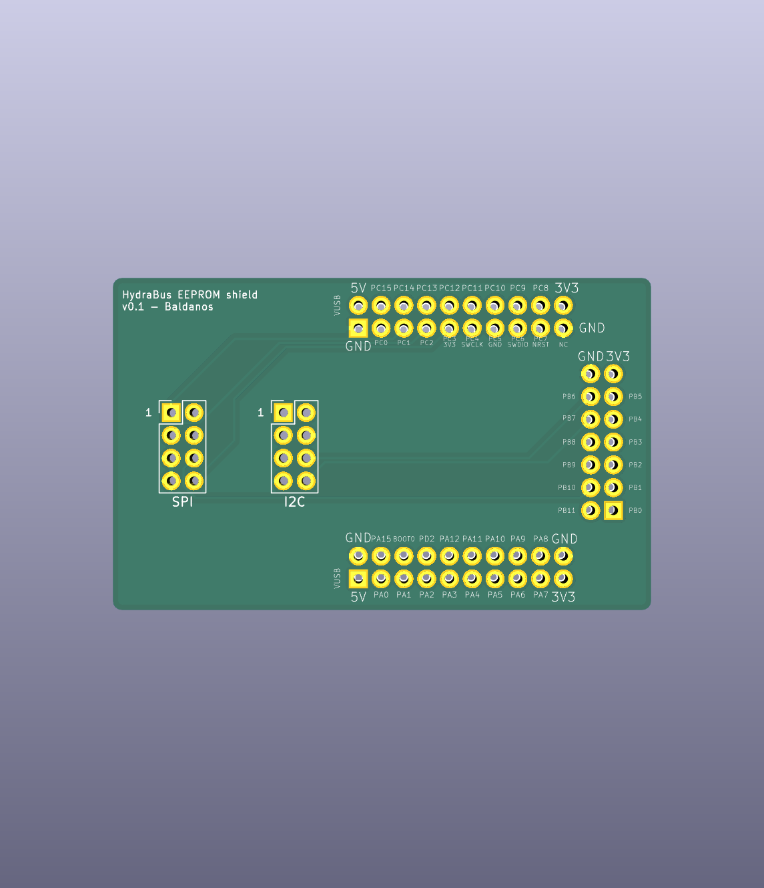

# HydraEEPROM - Hydrabus EEPROM shield

This shield is made to simplify operations on small I2C and SPI EEPROMS in SOIC8
format. It is better combined with a SOIC8 clip like [these
ones](https://www.aliexpress.com/wholesale?SearchText=soic8+clip).
